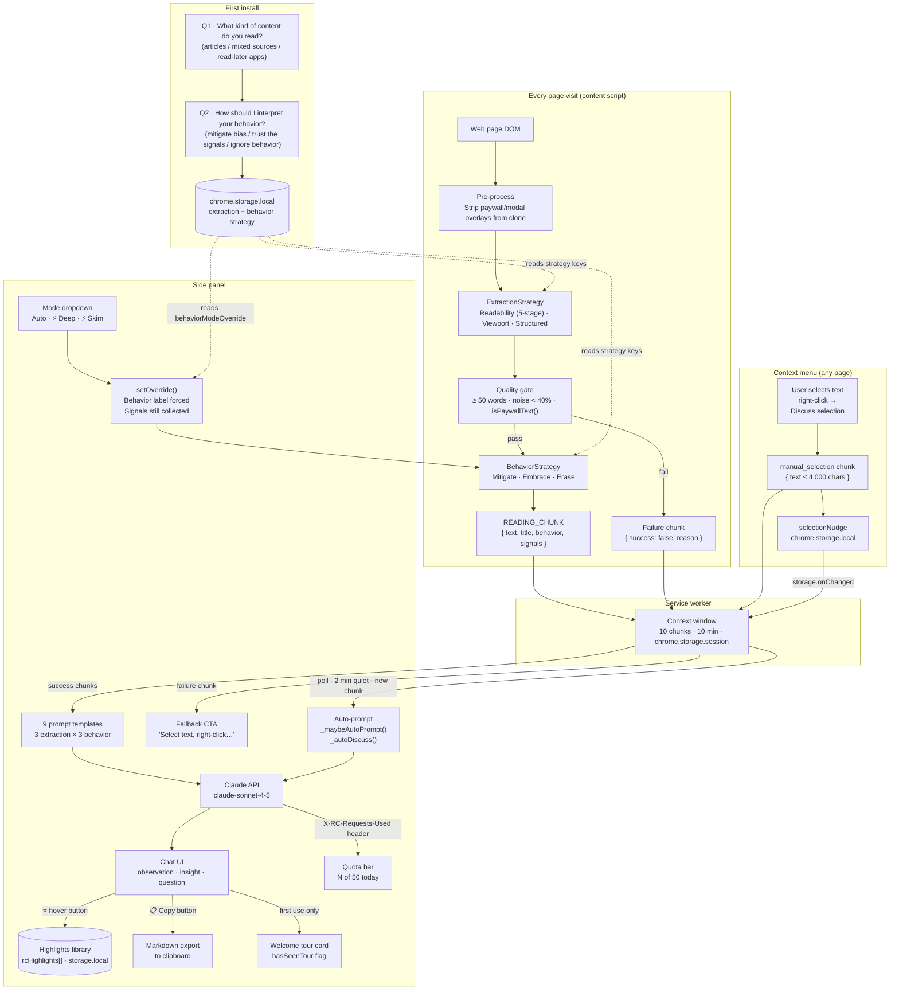

# Architecture

← [Back to README](README.md)

---

## System flowchart



---

## Onboarding → agent config flow

On first install the extension opens a three-step onboarding page before any reading begins.

**Step 1** asks what kind of content you mainly read. Your answer sets `extractionStrategy` in `chrome.storage.local`:
- "Articles, blogs, news" → `readability`
- "Mixed sources, SPAs, paywalled pages" → `viewport`
- "Read-later apps (Pocket, Instapaper, Matter…)" → `structured`

**Step 2** asks how the AI should use your reading behavior. Your answer sets `behaviorStrategy`:
- "Help me notice my own reading patterns" → `mitigate`
- "Let the AI interpret the raw signals itself" → `embrace`
- "Ignore how I read, focus on the content" → `erase`

**Step 3** collects your Anthropic API key (optional — can be added later in Settings). If entered, it is stored as `anthropicApiKey` in `chrome.storage.local` and used for direct API calls. This step is skippable; the extension will prompt with a clear inline error message if a call is attempted without a key configured.

All config values are written atomically with `onboardingComplete: true`. The service worker checks this flag on every install event. You can revisit your choices at any time via the ⚙ icon in the sidebar.

---

## Extraction pipeline (ReadabilityStrategy)

ReadabilityStrategy runs a five-stage pipeline on every page, stopping at the first stage that succeeds:

| Stage | Method | Succeeds when |
|---|---|---|
| 0 | Pre-process | Clone document; strip `[class*="modal/paywall/gate/intercept/overlay"]` elements |
| 1 | Readability.js | `textContent ≥ 200 chars` AND `isPaywallText()` returns false |
| 2 | `<article>` / `<main>` innerText | `≥ 200 chars` AND not paywall text |
| 3 | First 3 visible `<p>` tags | `≥ 100 chars` AND not paywall text |
| 4 | Filtered innerText (strip NAV/FOOTER/etc.) | Any non-empty text |
| 5 | Failure | Returns `{ success: false, error: "unable to extract" }` |

The original DOM is never modified. All mutations happen on `document.cloneNode(true)`. Each stage logs which path succeeded to the console.

`isPaywallText()` in `lib/extraction/quality.js` matches 20+ phrase patterns characteristic of soft-paywall intercepts (e.g. "subscribe to continue reading", "sign in to read") while avoiding false positives on articles that merely discuss subscriptions.

---

## Graceful extraction fallback

On pages where all extraction stages fail, the sidebar replaces the "Discuss this" CTA with: *"Couldn't read this page. Select text, right‑click, and choose 'Discuss selection with Marginalia'."*

A context menu item is registered on install. When triggered, the selected text (≤ 4 000 chars) is ingested as a `manual_selection` chunk, the sidebar re-polls immediately via a `selectionNudge` storage flag, and the CTA changes to **"Discuss selection"**.

---

## Export, highlights, and quota

### Conversation export

The 📋 clipboard button in the sidebar header copies the current conversation as Markdown. Format:

```markdown
# Marginalia — Article Title
*https://example.com · May 13, 2026*

---

**You:** Discuss this

---

**Observation**
…

**Insight**
…

**Question**
…

---
```

`_conversationLog` resets when "Discuss this" starts a new exchange. Clipboard API is used with an `execCommand("copy")` fallback.

### Highlights library

Each of the three sections in every AI response has a ⭐ button (visible on hover). One click saves that passage to `chrome.storage.local`:

```js
{
  id:        "hl_1715000000000_a3f2",
  text:      "The highlighted passage…",
  section:   "observation",    // "observation" | "insight" | "question"
  pageTitle: "Article Title",
  pageUrl:   "https://…",
  savedAt:   1715000000000,
}
```

The library is capped at 50 entries (oldest evicted on overflow). The bookmark icon in the header opens a slide-in panel rendering cards newest-first with colored section badges, truncated italic text, page + date metadata, and a per-card × delete button.

### API usage display

The settings panel shows an "API usage" row that adapts to whichever call path is active:

- **Direct key** — displays "Using your own API key". No quota tracking needed.
- **Proxy** — the Cloudflare Worker attaches `X-RC-Requests-Used` and `X-RC-Requests-Limit` response headers (exposed via `Access-Control-Expose-Headers`). `lib/api.js` reads those headers after each successful proxy call and caches `{ used, limit, date }` to `chrome.storage.local` under `rcQuota`. The settings panel shows a thin amber progress bar and "N of 50 proxy requests today", turning red at ≥ 80% consumption.

---

## READING_CHUNK shape

Every page visit produces one of three chunk shapes.

**Success chunk** (extraction passed quality gate):
```js
{
  success:   true,
  text:      "…",               // article body, ≤ 8 000 chars
  title:     "…",
  url:       "https://…",
  timestamp: 1715000000000,
  wordCount: 1240,
  strategy:  "readability",     // "readability" | "viewport" | "structured" | "manual_selection"
  behavior:  "deep",            // "deep" | "skim" | "neutral" | "embrace" | null (erase)
  signals: {
    dwell:          95,         // active seconds on page (capped at 300)
    scrollVelocity: 42,         // px/s over last 3 s
    active:         true        // keyboard/mouse interaction seen
  }
}
```

**Failure chunk** (extraction failed):
```js
{
  success:   false,
  reason:    "low_quality",
  url:       "https://…",
  title:     "…",
  timestamp: 1715000000000,
  text:      "",
  strategy:  "failed",
  behavior:  "neutral",
  signals:   { dwell: 0, scrollVelocity: 0, active: false }
}
```

**Manual selection chunk** (context menu → "Discuss selection"):
```js
{
  success:   true,
  text:      "…",              // selected text, ≤ 4 000 chars
  url:       "https://…",
  timestamp: 1715000000000,
  wordCount: 340,
  strategy:  "manual_selection",
  behavior:  "neutral",
  signals:   { dwell: 0, scrollVelocity: 0, active: false }
}
```

---

## API call paths

`lib/api.js` supports two call paths, checked in order on every request:

**Path 1 — Direct (user's own key)**

```
chrome.storage.local → anthropicApiKey
         ↓
Chrome extension → POST api.anthropic.com/v1/messages
                   (x-api-key: <stored key>, anthropic-version: 2023-06-01)
         ↓
   Parse response text → return to sidebar
```

No proxy or deployment required. `host_permissions` in `manifest.json` allows `https://api.anthropic.com/*`. A 401 response surfaces as `INVALID_API_KEY`, prompting the user to check their key in Settings.

**Path 2 — Cloudflare Worker proxy (shared / demo use)**

```
Chrome extension → POST /v1/messages → Cloudflare Worker → api.anthropic.com
                                             ↓
                                      KV rate-limit check
                                      (DAILY_LIMIT = 50 global/day)
                                             ↓
                                      Inject x-api-key from Worker Secret
                                             ↓
                                      Return Anthropic response
                                      + X-RC-Requests-Used / X-RC-Requests-Limit headers
                                             ↓
                              api.js caches { used, limit, date } → chrome.storage.local
                              → quota bar in settings panel
```

Used when no key is stored in `chrome.storage.local` and `PROXY_ENDPOINT` in `background.js` has been configured. If neither path is available, `callClaude` throws `NO_API_KEY` and the sidebar shows a prompt directing the user to Settings.

**Error codes emitted by `_fetchClaude`:**

| Code | Trigger |
|---|---|
| `NO_API_KEY` | No stored key and proxy not configured |
| `NETWORK_ERROR` | fetch() threw (offline, DNS failure) |
| `INVALID_API_KEY` | 401 from Anthropic (direct path) |
| `RATE_LIMITED` | 429 from Anthropic with a stored user key (Anthropic-side rate limit) |
| `DEMO_LIMIT_REACHED` | 429 from proxy (global daily quota hit) |
| `API_ERROR_<status>` | Any other non-2xx response |
| `PARSE_ERROR` | Response body could not be parsed as JSON |
| `EMPTY_RESPONSE` | API returned a content array with no text |

**Deploying the proxy:**

```bash
npm install -g wrangler && wrangler login
wrangler kv:namespace create RATE_LIMIT   # copy id into wrangler.toml
wrangler secret put ANTHROPIC_API_KEY
cd cloudflare-worker && wrangler deploy
# Set PROXY_ENDPOINT in lib/api.js to your worker URL
```

**Privacy note:** the proxy sees request bodies but not your identity. No data is logged or stored beyond the KV request counter.

**KV daily quota reset — two options for self-hosters:**

| Option | How it works | When to use |
|---|---|---|
| **TTL-based expiry (default)** | Each counter key (`quota:YYYY-MM-DD`) carries a 25 h `expirationTtl`. A new calendar day creates a fresh key starting at 0; the old key self-destructs. No cron needed. | Default for all deployments. |
| **Explicit midnight cron** | Add `[triggers] crons = ["0 0 * * *"]` to `wrangler.toml` and uncomment the `scheduled()` handler in `worker.js`. The handler pre-seeds the new day's key at midnight UTC. | Use when you want a deterministic reset time, an audit log entry, or a hook to alert on the previous day's usage. |

To raise or lower the daily limit, change `DAILY_LIMIT` in `worker.js` and `wrangler deploy`.

---

## File structure

```
manifest.json                     v0.9.0
LICENSE                           MIT
background.js                     Service worker — chunk ingestion, context menu, side panel
content.js                        Content script — extraction + behavior pipeline + failure chunks
vendor/
  Readability.js                  Mozilla Readability 0.5.0 (vendored, unmodified)
lib/
  context.js                      Rolling context window (service worker)
  api.js                          callClaude() — direct key path + proxy fallback, quota header caching
  prompts.js                      getSystemPrompt() · buildUserMessage() — 9 templates,
                                  branches on null / "embrace" / mitigate behavior
  extraction/
    interface.js                  JSDoc type definitions
    quality.js                    qualityCheck() + isPaywallText() — word count, noise, paywall
    index.js                      getStrategy() factory
    strategies/
      readability.js              5-stage pipeline + paywall stripping
      viewport.js                 IntersectionObserver + MutationObserver
      structured.js               Platform CSS selectors + Readability fallback + source URL
  behavior/
    interface.js                  JSDoc type definitions
    index.js                      getBehaviorStrategy() factory + override propagation listener
    strategies/
      mitigate.js                 deep/skim/neutral classifier + setOverride()
      embrace.js                  raw signal collection, no classifier
      erase.js                    no listeners, behavior: null
onboarding/
  onboarding.html                 Three-step setup: extraction strategy, behavior strategy, API key
  onboarding.css
  onboarding.js
sidebar/
  sidebar.html                    Side panel shell — mode dropdown, 📋/★/⚙/ⓘ header buttons,
                                  API key field, highlights library panel, usage row, fallback CTA,
                                  persona tooltip slot (#personaTooltip)
  sidebar.css                     Marginalia chat, design tokens, highlight cards,
                                  tour card, API key input, usage bar, mode select styles,
                                  persona info button + tooltip card
  sidebar.js                      Context polling, chat history, strategy switcher,
                                  mode override, export/copy, highlights library,
                                  first-use welcome tour, API key save/load, usage display,
                                  continuous paced auto-prompting (_maybeAutoPrompt / _autoDiscuss),
                                  persona tooltip (_togglePersonaTooltip / _closePersonaTooltip),
                                  dynamic loading phrases, RATE_LIMITED error code
cloudflare-worker/
  worker.js                       Proxy + KV rate limiter + X-RC-Requests-Used/Limit headers;
                                  KV Reset Mechanism docs (TTL vs cron options);
                                  commented-out scheduled() handler for optional midnight reset
  wrangler.toml                   KV namespace binding; cron trigger docs (commented out)
icons/
  icon16.png · icon48.png · icon128.png
```

---

## What's implemented

| Component | Status | Notes |
|---|---|---|
| MV3 scaffold — manifest, service worker, content script, sidebar | ✅ | |
| ReadabilityStrategy | ✅ | 5-stage pipeline: pre-process → Readability → landmark → visible-p → innerText |
| Paywall overlay stripping | ✅ | Pre-processes clone; strips modal/paywall/gate/intercept/overlay |
| isPaywallText() heuristic | ✅ | 20+ phrase patterns; used at every extraction stage |
| Quality gate | ✅ | ≥ 50 words, noise ratio < 40% |
| SPA navigation detection | ✅ | MutationObserver + popstate |
| ViewportStrategy | ✅ | IntersectionObserver + MutationObserver; leaf-dedup; DOM-order sort |
| StructuredStrategy | ✅ | Platform CSS selectors → Readability → innerText; source URL extraction |
| MitigateStrategy | ✅ | Active dwell · scroll velocity · keyboard/mouse signals |
| EmbraceStrategy | ✅ | Same signal collection as Mitigate; raw numbers forwarded, no classifier |
| EraseStrategy | ✅ | No listeners; behavior: null → prompts.js emits tracking:off |
| Manual mode override (Deep / Skim / Auto) | ✅ | Sidebar dropdown; setOverride(); storage.onChanged propagation |
| Context window | ✅ | Rolling 10-chunk / 10-min window, chrome.storage.session |
| Onboarding flow | ✅ | Three-step setup: extraction strategy, behavior strategy, optional API key |
| 9 prompt templates | ✅ | One per persona; three-part structure enforced in every prompt |
| Claude API integration | ✅ | Direct (own key) + proxy fallback; named error codes; NO_API_KEY / INVALID_API_KEY surfaces in UI |
| API key management | ✅ | Collected in onboarding step 3; editable in Settings; stored in chrome.storage.local |
| Sidebar chat UI | ✅ | Marginalia-style AI messages, conversation history (8 msg cap), strategy switcher |
| Graceful extraction failure | ✅ | success:false chunk on all failure paths; sidebar shows fallback CTA |
| Context menu "Discuss selection" | ✅ | Registered on install; selected text ≤ 4 000 chars; manual_selection strategy |
| Cloudflare Worker proxy | ✅ | Optional; forwards to Anthropic; global KV rate limit; used when no local key is stored |
| Export conversation as Markdown | ✅ | 📋 header button; _conversationLog → Markdown; clipboard API with execCommand fallback |
| Highlights library | ✅ | ⭐ per-section save; rcHighlights[] in storage.local; slide-in panel, 50-entry cap, per-card delete |
| First-use welcome tour | ✅ | Dismissable card on first "Discuss this"; hasSeenTour flag; CSS fade-in/out |
| API usage display | ✅ | Shows "Using your own key" for direct path; proxy path shows request counter + progress bar, red at ≥ 80% |
| Continuous paced auto-prompting | ✅ | `_maybeAutoPrompt()` fires after ≥ 2 min quiet (no AI msg, no typing); deduped by url+30s bucket; `_autoDiscuss()` silent-fails on error |
| Persona info tooltip (ⓘ) | ✅ | Inline button next to strategy badge; slides in a card with persona name + one-line description for all 9 grid cells; closes on outside click |
| Dynamic loading phrases | ✅ | Spinner label rotates through 6 variants by `_sessionTurnCount`; never shows "Thinking…" twice in a row |
| RATE_LIMITED error code | ✅ | 429 from Anthropic on direct-key path now throws `RATE_LIMITED` (not `DEMO_LIMIT_REACHED`); correct user-facing copy in `ERROR_COPY` |
| Proxy KV reset documentation | ✅ | `worker.js` documents TTL-based (default) and cron-based (optional) reset mechanisms; `wrangler.toml` has commented-out cron trigger + `scheduled()` handler ready to enable |
